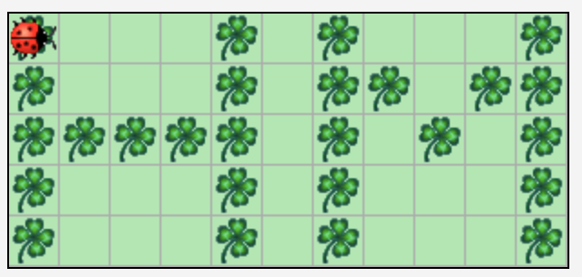
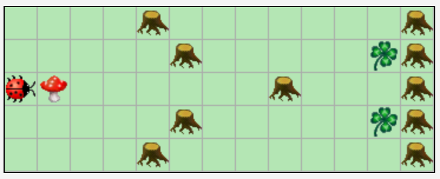
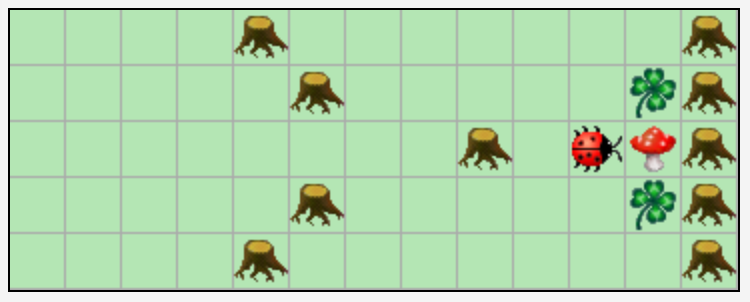
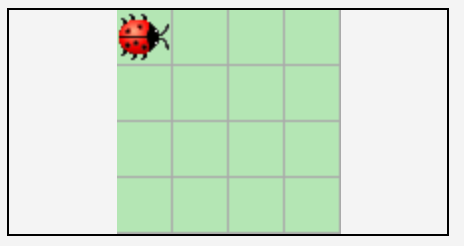
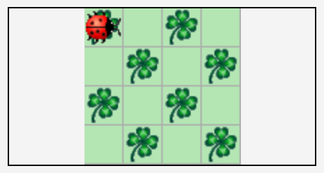

= Übungsblatt 1 - Softwareentwicklung I
:icons: font
Prof. Dr. Ullrich Hafner <ullrich.hafner@hm.edu>
:toc-title: Inhaltsverzeichnis
:chapter-label:
:chapter-refsig: Kapitel
:section-label: Abschnitt
:section-refsig: Abschnitt

:xrefstyle: short
:sectnums:
:partnums:
ifndef::includedir[:imagesdir: ./]
ifndef::imagesdir[:imagesdir: ./]
ifndef::plantUMLDir[:plantUMLDir: .plantuml/]
:figure-caption: Abbildung
:table-caption: Tabelle

[TIP]
====

Die Abgabe dieses Übungsblattes ist möglich bis zum 23.10. 23:00. Laden Sie Ihre Lösung im https://classroom.github.com/a/j7tNOfV3[GitHub Classroom Kara1] Projekt auf den eigenen `main` Branch hoch. Im Praktikum zeigen wir Ihnen, wie Sie dies am einfachsten umsetzen.

====

== Hallo Kara!

Schreiben Sie Ihr erstes "Hello World!" Programm für Kara, das in der vorgegebenen leeren Welt von 11x5 Kästchen die Initialen „HM“ unserer Hochschule in Form von Kleeblättern schreibt. Kara startet dabei in der linken oberen Ecke mit Blick nach rechts.

.Ausgangssituation (links) und erwartetes Ergebnis (rechts)
image:images/1-start.png[Ausgangssituation, width=40%, pdfwidth=40%]
image:images/right-arrow.png[width=10%, pdfwidth=10%]

== Pilzball

Im Wald spielen Käfer gegen Bäume Pilzball. Um ein Tor zu schießen, muss Kara den vor ihm liegenden Pilz zwischen die Kleeblätter am rechten Spielfeldrand schieben. Programmieren Sie Kara so, dass er den Pilz an den Bäumen vorbei ins Tor schiebt und dann dort stehenbleibt.

.Ausgangssituation (links) und erwartetes Ergebnis (rechts)

image:images/right-arrow.png[width=10%, pdfwidth=10%]

== Methoden

Verbessern Sie Ihr Programm aus Aufgabe 1, sodass Sie die Anzahl der move() Anweisungen minimieren. Nutzen Sie dabei die Tatsache, dass das Resultat aus Zeilen besteht, von denen einige identisch sind (siehe Abbildung). Schreiben Sie für jede unterschiedliche Zeile (A, B, C) eine Methode und rufen Sie diese Methoden in der richtigen Reihenfolge auf, bis wieder die Abkürzung HM zu sehen ist.

image:images/3-zeilen.png[Unterteilung-des Bildes, width=40%, pdfwidth=40%]

Nutzen Sie auch die Möglichkeit, dass Kara beim Überschreiten des Rands wieder auf der gegenüberliegenden Seite erscheint! Lässt sich das Programm noch weiter kürzen? Versuchen Sie weniger als 40 Anweisungen zu verwenden.

== Schachbrettmuster

Schreiben Sie ein Programm, das ein Schachbrettmuster in einer leeren 4x4 Welt erzeugt. Schaffen Sie es, mit weniger als 15 Anweisungen auszukommen? Nutzen Sie wieder Methoden, um Codezeilen zu sparen.

.Ausgangssituation (links) und erwartetes Ergebnis (rechts)

image:images/right-arrow.png[width=10%, pdfwidth=10%]

