= Übungsblatt 2 - Softwareentwicklung I
:icons: font
Prof. Dr. Ullrich Hafner <ullrich.hafner@hm.edu>
:toc-title: Inhaltsverzeichnis
:chapter-label:
:chapter-refsig: Kapitel
:section-label: Abschnitt
:section-refsig: Abschnitt

:xrefstyle: short
:sectnums!:
:partnums:
ifndef::includedir[:imagesdir: ./]
ifndef::imagesdir[:imagesdir: ./]
ifndef::plantUMLDir[:plantUMLDir: .plantuml/]
:figure-caption: Abbildung
:table-caption: Tabelle

[TIP]
====

Die Abgabe dieses Übungsblattes ist möglich bis zum 6.11. 23:00. Laden Sie Ihre Lösung im https://classroom.github.com/a/j7tNOfV3[GitHub Classroom Kara1] Projekt auf den eigenen `main` Branch hoch. Im Praktikum zeigen wir Ihnen, wie Sie dies am einfachsten umsetzen.

====

== 5. Radieren und Schreiben

Im letzten Aufgabenblatt hatten Sie in Aufgabe 1 und 3 die Buchstaben HM in Karas Welt zu schreiben. Ändern Sie Ihre
Lösung zu dieser Aufgabe so ab, dass das Programm immer das geforderte HM Bild malt, egal wie vorher die Welt mit
Blättern gefüllt ist.

.Ausgangssituation 1 (links) und erwartetes Ergebnis (rechts)
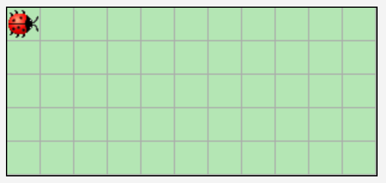
image:images/right-arrow.png[width=10%, pdfwidth=10%]
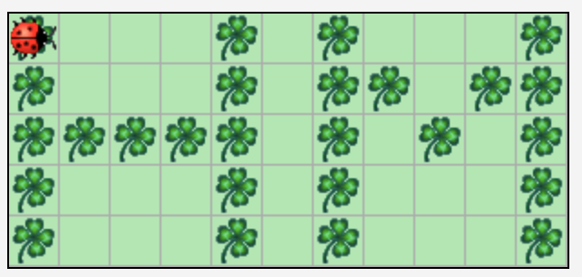

.Ausgangssituation 2 (links) und erwartetes Ergebnis (rechts)
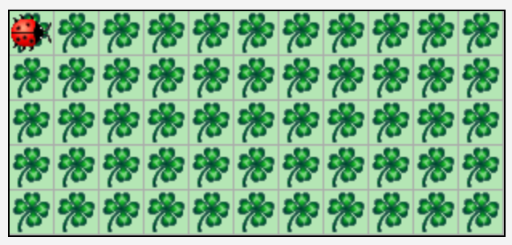
image:images/right-arrow.png[width=10%, pdfwidth=10%]

== 6. Zebrastreifen

Schreiben Sie ein Programm, das Kara eine beliebig große leere Welt mit einem Zebrastreifen befüllt.
Die Welt kann eine beliebige Höhe _h_ ( _h_ ≥ 1) und eine gerade Breite 2 * _b_ ( _b_ ≥ 1) haben.
Denken Sie auch an die Höhe 1 und 2 und die Breite 2. Kara startet wieder links oben – dies soll auch die
Endposition sein.

.Ausgangssituation 1 (links) und erwartetes Ergebnis (rechts)
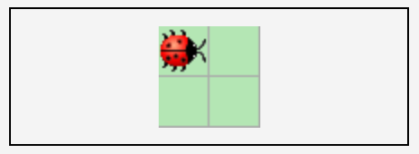
image:images/right-arrow.png[width=10%, pdfwidth=10%]
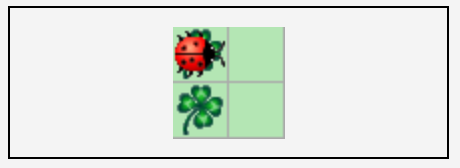

.Ausgangssituation 2 (links) und erwartetes Ergebnis (rechts)
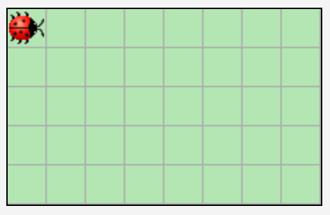
image:images/right-arrow.png[width=10%, pdfwidth=10%]
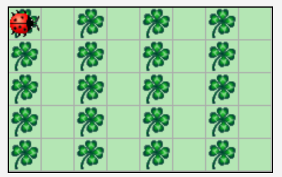

== 7. Zäune

Kara will die Grenzen seiner Welt bepflanzen, d.h. einen Zaun aus Kleeblättern um die Welt ziehen. Schreiben Sie dazu
ein Programm, das Kara in einer leeren Welt mit beliebiger Größe (mindestens 2*2 Felder) auf allen Feldern am Rand ein
Kleeblatt ablegt. Kara startet wieder links oben – dies soll auch die Endposition sein.

.Ausgangssituation 1 (links) und erwartetes Ergebnis (rechts)
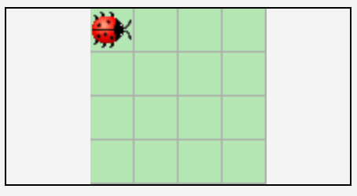
image:images/right-arrow.png[width=10%, pdfwidth=10%]
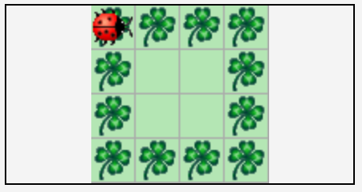

.Ausgangssituation 2 (links) und erwartetes Ergebnis (rechts)
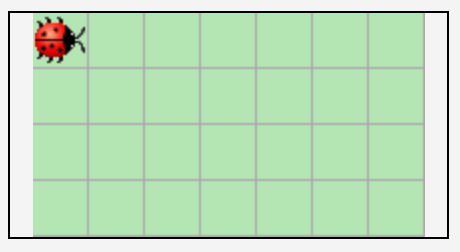
image:images/right-arrow.png[width=10%, pdfwidth=10%]
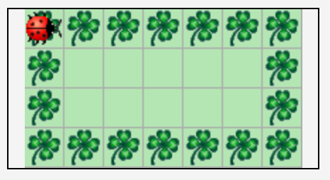

== 8. Labyrinth

Schreiben Sie ein Programm, das Kara durch ein Labyrinth in einem Wald führt, bis es das einzige Kleeblatt gefunden hat. Dieses Kleeblatt soll Kara anschließend aufsammeln. Der Weg durch den Wald beginnt in der 1. Spalte links am Rand und endet rechts am Rand in der letzten Spalte. Der Start und das Ende können sich dabei in einer beliebigen Zeile befinden, lediglich die erste und letzte Zeile ist nicht möglich.

Das Labyrinth ist mindestens 3*3 groß und wie folgt aufgebaut:

- Das Labyrinth hat bis auf den Ein- und Ausgang einen durchgehenden Rand aus Bäumen.
- Die Spalten mit ungerader Nummer (erste, dritte, ...) sind bis auf einen einzelnen Durchgang komplett mit Bäumen gefüllt. Der Durchgang ist beliebig positioniert, lediglich die erste und letzte Zeile ist nicht möglich.
- Die Spalten mit gerader Nummer (zweite, vierte, ...) sind bis auf den Rand oben und unten leer.
- Der Ausgang ist mit einem Kleeblatt markiert.

.Ausgangssituation 1 (links) und erwartetes Ergebnis (rechts)
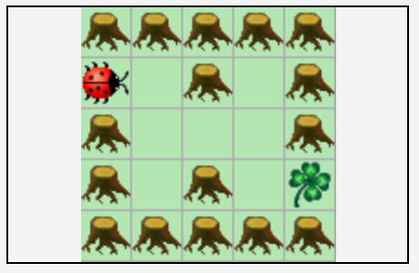
image:images/right-arrow.png[width=10%, pdfwidth=10%]
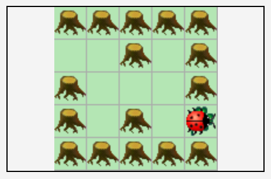

.Ausgangssituation 2 (links) und erwartetes Ergebnis (rechts)
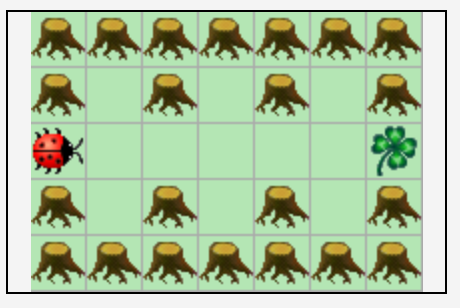
image:images/right-arrow.png[width=10%, pdfwidth=10%]
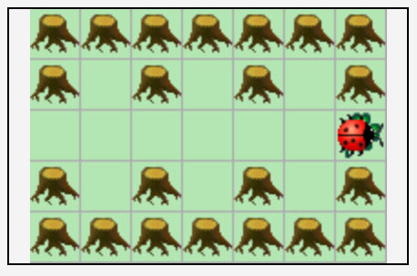

