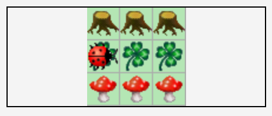

= Übungsblatt 3 - Softwareentwicklung I
:icons: font
Prof. Dr. Ullrich Hafner <ullrich.hafner@hm.edu>
:toc-title: Inhaltsverzeichnis
:chapter-label:
:chapter-refsig: Kapitel
:section-label: Abschnitt
:section-refsig: Abschnitt

:xrefstyle: short
:!sectnums:
:partnums:
ifndef::includedir[:imagesdir: ./]
ifndef::imagesdir[:imagesdir: ./]
ifndef::plantUMLDir[:plantUMLDir: .plantuml/]
:figure-caption: Abbildung
:table-caption: Tabelle

[TIP]
====

Die Abgabe dieses Übungsblattes ist möglich bis zum 26.11. 23:59. Laden Sie Ihre Lösungen im
https://classroom.github.com/a/5sCzTSvX[GitHub Classroom] Projekt auf den eigenen `master` Branch hoch.
Im Praktikum haben Sie gesehen, wie Sie dies am einfachsten umsetzen. Eine Verwendung von Pull Requests ist nicht
erforderlich. Wenn Sie Pull Requests nutzen, müssen alle Lösungen in einem Pull Request abgegeben werden, sonst
funktioniert das Autograding nicht.

====

[hinweise]
== Allgemeine Hinweise bzw. Tipps

[TIP]
====

Beachten Sie wieder, dass in allen Aufgaben beliebige Welten (gemäß der Aufgabenstellung) zulässig sind.
D.h. eine Aufgabe ist nur teilweise gelöst, wenn Ihr Programm nur für einige der abgebildeten Varianten funktioniert.
Ebenso ist die Aufgabe nur teilweise gelöst, wenn zusätzliche Welten aus dem Autograding (meine automatisierten Tests)
nicht funktionieren. Die Welten im Autograding sind nicht immer identisch zu den Szenarien zum manuellen
Ausprobieren. Wenn ein Testfall daher einen Fehler meldet, lohnt es sich auch diese Welt in Greenfoot durchzuspielen. Sie
können diese Welten in der Datei `WorldSetup.txt` editieren.

Bisher war die Verwendung von komplexeren Java Konstrukten (die noch in späteren Vorlesungen vorgestellt werden)
nicht verboten. Dies wird für diese Aufgaben etwas modifiziert:
Instanzvariablen, Arrays oder anderweitige Container sind in diesem Blatt **nicht erlaubt**. Nur lokale Variablen
(und ggf. Methodenparameter) sind zur Speicherung von Werten erlaubt. Ebenso dürfen an den vorhandenen Klassen
nur die vorgestellten Kara Methoden aufgerufen werden. (Der Compiler im Autograding wird sonst einen Compile
Fehler melden.) Im Zweifelsfall fragen Sie bitte bei mir oder den Tutoren nach, ob Ihre Lösungsvariante erlaubt ist.

Und noch ein letzter Tipp: in vielen Aufgaben benötigen Sie die Breite oder Höhe der Welt als Zahl. Diese können Sie
selbst algorithmisch mit den in der Vorlesung vorgestellten Sprachmitteln ermitteln.

====

[hinweise]

== Eigenständigkeitserklärung

Für die restlichen Abgaben ist die Abgabe einer Eigenständigkeitserklärung erforderlich. Diese finden Sie in Moodle als
Text Datei. Spielen Sie diese Datei zu jeder Abgabe ins GitHub Repository ein. Eine unterschriebene eingescannte Datei ist
nicht erforderlich. Das Einspielen in Ihr privates Repository ersetzt eine Unterschrift.

== 9. Spieglein, Spieglein an der Wand

Schreiben Sie ein Programm für Kara, das ein vorgegebenes Baummuster spiegelt, indem Kara entsprechende
Pilze auf der gegenüberliegenden Seite der Spiegelachse (Blätterspur) verschiebt. Die Ausgangswelt ist nach folgendem Muster
aufgebaut:

- Die Welt hat eine ungerade Anzahl an Zeilen (Höhe: _h_ = 2 _n_ + 1  mit _n_ ≥ 1),
in der Mitte (Zeile _n_) befindet sich die Spiegelachse als Spur aus Blättern.
- Über der Spiegelachse befindet sich ein festes Muster aus Bäumen, direkt darunter eine komplette Zeile mit Pilzen.
- In jeder Spalte befinden sich genau ein Blatt, ein Baum (darüber) und ein Pilz (darunter).
- Die Breite der Welt ist beliebig.

Kara startet dabei auf der linken Seite der Blätterspur mit Blick nach rechts. Nach dem Ende des Programms soll Kara
wieder in der Ausgangsposition stehen, die Blätter sind unverändert. Die Pilze zeigen das an der Blätterlinie
gespiegelte Muster dar.

.Ausgangssituation 1 (links) und erwartetes Ergebnis (rechts)

image:images/right-arrow.png[width=10%, pdfwidth=10%]

.Ausgangssituation 2 (links) und erwartetes Ergebnis (rechts)

image:images/right-arrow.png[width=10%, pdfwidth=10%]

.Ausgangssituation 3 (links) und erwartetes Ergebnis (rechts)

image:images/right-arrow.png[width=10%, pdfwidth=10%]

== 10. Dreiecke malen

Kara malt gerne Figuren in Ihre Welt: schreiben Sie ein Programm, das Kara ein Dreieck in eine leere Welt
malen lässt. Die Welt kann beliebig groß werden und hat folgende Ausmaße: Sie hat eine ungerade Breite, und die Höhe
ist abhängig von der Breite, sodass das Dreieck die gesamte Welt füllt. Das ganze lässt sich am besten in einer Formel
ausdrücken:

Gegeben ist eine natürliche Zahl _n_ ≥ 1, dann gilt

- Breite: _b_ = 2 _n_ + 1
- Höhe: _h_ = (_b_ + 1) / 2

Kara startet wieder links oben mit Blick nach rechts und soll genau so wieder am Ende stehen bleiben. Um die in der
Vorlesung besprochenen Mathematik Operatoren zu üben, gibt es noch eine weitere Schwierigkeit: Das Dreieck soll nicht
vollständig ausgefüllt werden, sondern nur schattiert. D.h. in einer Zeile wechselt sich immer ein Blatt und eine leere Stelle ab.
Begonnen wird immer mit einem Blatt, dann wird wieder eines ausgesetzt.

Umgangssprachlich zusammengefasst: es soll ein Dreieck gemalt werden, das außen auf allen drei Seiten gleich viele Blätter liegen
hat. An jedes Blatt grenzen oben, unten, links und rechts jeweils 4 leere Zellen.

.Ausgangssituation 1 (links) und erwartetes Ergebnis (rechts)

image:images/right-arrow.png[width=10%, pdfwidth=10%]

.Ausgangssituation 2 (links) und erwartetes Ergebnis (rechts)

image:images/right-arrow.png[width=10%, pdfwidth=10%]

.Ausgangssituation 3 (links) und erwartetes Ergebnis (rechts)

image:images/right-arrow.png[width=10%, pdfwidth=10%]

== 11. Sieger ermitteln

Kara möchte den besten Gärtner ihrer Welt küren. Dazu hatte jeder Gärtner in der Welt ein Anbaufeld
aus einer gesamten Zeile bekommen, um dort Kleeblätter anzubauen. Links ist ein solches Anbaufeld durch
einen Baum begrenzt, rechts durch einen Pilz.
Nun ist es an der Zeit, die Felder auszuwerten. Kara beginnt
diesmal am Startpunkt in der zweiten Spalte und Zeile und läuft dann die
gesamte Welt Zeile für Zeile ab und ermittelt den Sieger. D.h. in jeder Zeile muss die Anzahl der Kleeblätter
zwischen dem Baum (links) und dem Pilz (rechts) erfasst werden. Sieger ist diejenige Zeile mit den meisten
Blättern. Um den Sieger zu markieren, soll der am Ende stehende Pilz um eine Position nach rechts verschoben
werden. Bei Gleichstand wird nur der erste der Gewinner markiert (von oben gezählt). Am Ende soll Kara wieder
am Startpunkt herauskommen und nach rechts schauen.

.Ausgangssituation 1 (links) und erwartetes Ergebnis (rechts)

image:images/right-arrow.png[width=10%, pdfwidth=10%]

.Ausgangssituation 2 (links) und erwartetes Ergebnis (rechts)

image:images/right-arrow.png[width=10%, pdfwidth=10%]

.Ausgangssituation 3 (links) und erwartetes Ergebnis (rechts)

image:images/right-arrow.png[width=10%, pdfwidth=10%]

.Ausgangssituation 4 (links) und erwartetes Ergebnis (rechts)

image:images/right-arrow.png[width=10%, pdfwidth=10%]

== 12. Überall Hindernisse

Kara möchte die gesamte Welt erkunden, doch dies ist diesmal gar nicht so einfach:
In Karas Welt sind viele Hindernisse gesetzt worden. Entwickeln Sie ein Programm, das Kara durch die gesamte
(beliebig große) Welt wandern lässt, und die gesamte Anzahl die Hindernisse (d.h. Bäume und Pilze) auf dem Weg
zählt. Höhe und Breite der Welt sind mindestens 3 Felder.
Kara steht am Anfang in der linken oberen Ecke mit Blick nach rechts.
Es gilt außerdem folgende Abstandsregel: alle 8 Felder um ein Hindernis herum (auch über den Rand hinaus),
enthalten kein weiteres Hindernis. Die Welt enthält zu Beginn keine Blätter. Nach Ausführung Ihres Programms
ist der Zustand der Welt und die Position von Kara egal: wichtig ist nur die korrekte Ermittlung der Anzahl
der Hindernisse.

Verwenden Sie zur Ausgabe der korrekten Anzahl der Hindernisse am Ende Ihres Programms einmalig die folgenden
Anweisung:

[source,java]
----
public void act() {
    int obstaclesCounter = 0;

    [… Ermitteln der Hindernisse …]

    showMessage("Anzahl Hindernisse: " + obstaclesCounter);
}
----

Dadurch sehen Sie in Greenfoot das Ergebnis Ihres Programms in einem Dialog. Darüber hinaus kann ich dadurch im Autograding die korrekten
Werte für Ihren Algorithmus automatisiert prüfen.

.Ausgangssituation 1 - die kleinste Welt

.Ausgangssituation 2 - direkt beim Start ein Hindernis

.Ausgangssituation 3 - in der Ecke ganz unten ein Hindernis

.Ausgangssituation 4 - Slalom

